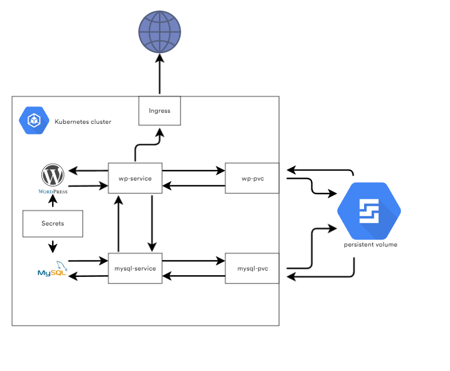

# Kubernetes module
## Task 3
* Find an app that requires some type of persistence: Suggestions: Blog, Task Manager, Address database...
* Deploy this on the cluster using persistent storage
* Specify the PV/PVC size to be 10 Gi or less
* Make app accessible from internet
* Test statefull application

***

## Structure

| FILE | DESCRIPTION|
|------|------------|
| [ingress-wp.yaml](ingress-wp.yaml)| ingress controller for accessing internet|
| [mysql-deploy.yaml](mysql-deploy.yaml)| MySql deployment |
| [pv-claim](pv-claim)| Persistant volume claims for mysql and wordpress | deployments |
| [secret.yaml](secret.yaml)| Secrets for mysql database and wordpress |
| [services.yaml](services.yaml)| Services for mysql and wordpress deployment |
| [wordpress-deploy.yaml](wordpress-deploy.yaml)| Wordpress deployment |

***

## Diagram



***
## Steps

1. Deploy following services

   ```
   kubectl apply -f ./pv-claim.yaml
   kubectl apply -f ./secret.yaml
   kubectl apply -f ./services.yaml
   kubectl apply -f ./mysq-deploy.yaml
   kubectl apply -f ./wordpress-deploy.yaml
   kubectl apply -f ./ingress-wp.yaml
   ```

2. Check deployment and services
   ```
   kubectl get all
   NAME                                   READY   STATUS              RESTARTS   AGE
   pod/wordpress-6fbb564b77-krz2h         1/1     Running             0          85m
   pod/wordpress-mysql-66d875b6bc-qgs5k   1/1     Running             0          89m

   NAME                      TYPE        CLUSTER-IP      EXTERNAL-IP   PORT(S)    AGE
   service/wordpress         ClusterIP   10.43.188.195   <none>        80/TCP     89m
   service/wordpress-mysql   ClusterIP   None            <none>        3306/TCP   89m

   NAME                              READY   UP-TO-DATE   AVAILABLE   AGE
   deployment.apps/wordpress         1/1     1            1           86m
   deployment.apps/wordpress-mysql   1/1     1            1           89m

   NAME                                         DESIRED   CURRENT   READY   AGE
   replicaset.apps/wordpress-6fbb564b77         1         1         1       86m
   replicaset.apps/wordpress-mysql-66d875b6bc   1         1         1       89m
   ```
3. Check persistant volume claims
   ```
   kubectl get pvc
   NAME              STATUS        VOLUME                                     CAPACITY   ACCESS MODES   STORAGECLASS     AGE
   mysql-pv-claim    Bound         pvc-1c35fab1-4958-4c9e-a526-18628ecf7a17   10Gi       RWO            hcloud-volumes   93m
   wp-pv-claim       Bound         pvc-8bbf29bc-b179-467b-9d86-4f05fb7d974f   10Gi       RWO            hcloud-volumes   93m
   ```

4. Testing

   If we destroy the pod with `kubectl detroy pod <pod_name>` and wait for recovery, we can see that our data is still available.